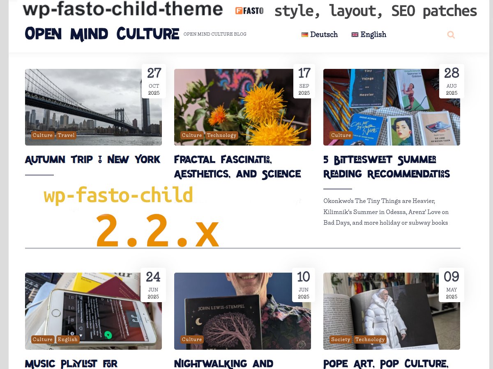

# wp-fasto-child-theme

minor theme modifications for using [fasto](https://wordpress.org/support/theme/fasto/) on [open-mind-culture.org](https://www.open-mind-culture.org/)



## Modifications

- [x] text 404 without "oh boy"
- [x] instant focus in search input
- [x] footer "made by" => "theme made by"
- [x] footer only 2 columns
- [x] modified poster image style
- [x] mobile header more calm and compact
- [x] accessibility: darker default font for better readability
- [x] modified category colors
- [x] new web fonts
- [x] new and experimental CSS features as progressive enhancement
- [x] utility classes for custom layout
- [x] performance optimization: disable WordPress heartbeat

### optional web fonts (non-free)

- [x] optional MyFontsWebfontsKit **NOT free to use**!
- [ ] (TODO fix `wp_dequeue_style` and remove action unloading obsolete web fonts from google; workaround: deactivate enqueuing in parent theme)

The optional web fonts, [Healthy Freak](https://www.myfonts.com/fonts/vozzy/healthy-freak/) by [Oleg Voznyy](https://www.myfonts.com/foundry/vozzy/), and  [Liebe Ruth](https://liebefonts.com/fonts/lieberuth) by [Ulrike Rausch](https://liebefonts.com/about) have been purchased by Ingo Steinke via [MyFonts.com](https://www.myfonts.com/) (Order # M12889860, Webfont Build ID 4424710).

While wp-fasto-child-theme is distributed under the GPL license,the optional MyFontsWebfontsKit is **not** covered by the GPL and may **not** be used on other websites without a valid license.

## Installation 

- create or [download a zip archive](https://github.com/openmindculture/wp-fasto-child-theme/releases/download/1.0.0/fasto-child-1.0.0.zip) of the directory `fasto-child`
- open WordPress administration (usually `/wp-admin`)
- open themes page
- add theme by uploading zip file
- activate theme

## Development

```
docker-compose up
```

Wait until WordPress and themes have been installed, then you should see something like

> local-wp-cli     | Success: Installed 1 of 1 themes.
> local-wp-cli exited with code 0


Open `wp-admin` in your browser:

http://localhost:8000/wp-admin

Log in with user `admin` and password `secret`.

Go to Appearance -> Themes.

### Optional manual setup

- Install WordPress

```
  wp core install 
    --path="/var/www/html" 
    --url="http://localhost:8000" 
    --title="Local Wordpress By Docker" 
    --admin_user=admin 
    --admin_password=secret 
    --admin_email=test@example.com;
```

- Install themes

either use the CLI

```
  wp theme install --activate fasto;
```

or

- checkout the original [fasto theme](https://wordpress.org/support/theme/fasto/) as parent theme into `/themes/fasto`
  (download from WordPress plugin page or, with `subversion` installed: 
  
```
cd wordpress/themes
svn co https://themes.svn.wordpress.org/fasto/1.5.6/ fasto
```

- mount the themes folder into a local WordPress docker container

  


### Optional: Install WordPress Plugins

Inside your WordPress docker container, you can use [wp-cli](https://wp-cli.org/) ...

```
docker-compose run --rm cli bash
cd /var/www/html/
```

... to install any plugin like, for example, Yoast SEO:

```
./wp-cli.phar plugin install wordpress-seo # Yoast SEO
```

### Copy Content

Create or copy relevant content e.g.footer widgets, more articles etc.

### Child Theme Development Resources

[developer.wordpress.org/themes/advanced-topics/child-themes/](https://developer.wordpress.org/themes/advanced-topics/child-themes/)
